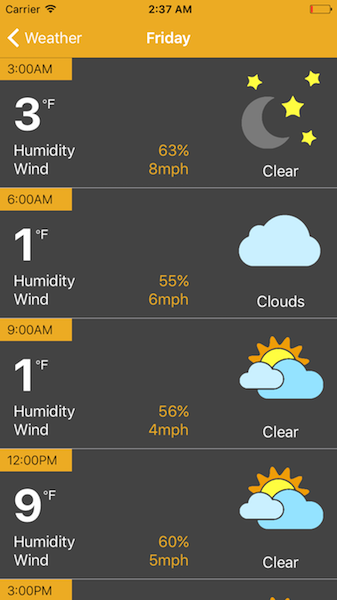

# OpenWeatherMapAPIExample

## Description
OpenWeatherMapAPIExample utilizes the [OpenWeatherMap API](http://openweathermap.org/api) to display pertinent weather information for the city of Columbia, MO. 

This example closely resembles, in architecture and user interface design, the backup weather module for the [GoMizzou](https://itunes.apple.com/us/app/gomizzou/id386691187?mt=8) application. The module was originally built as a backup weather source in the event that the local, primary weather source were to become unavailable. Were this to occur, a remote configuration file could be updated that would subsequently load the OpenWeatherMap data.

## Technical Breakdown
From a user interface standpoint, two common UIKit contructs were used - UITableView & UICollectionView. In the primary detail view, users can view the current weather conditions for Columbia, MO (data points are of course limited to the data provided by the API). Additionally, a five day forecast can be viewed in the collection view in the lower section of the view (*five day* forecast may be misleading as the first forecast day is always the current day - again, this is a limitation on the data provided by the API).

Selecting a forecast date will lead the user to a forecast detail view. Forecasts for a selected day are broken down into three hour increments (once again, data limition), providing the most pertinent information.

I myself designed all the UI. It should be noted that the storyboard designs would be greatly improved by the addition of UIStackViews. At the time of the original storyboarding, this module was required to support iOS 8 which did not support UIStackViews and thus all UI elements are placed within container UIViews and are constrained relative to other elements to recreate the functionality of stack views.

OpenWeatherMapAPIExample uses Core Data to locally persist weather data. The need for Core Data was originally a functional requirement for this module and was included for the sake of constency. 

## TODO:
- [x] Swift 3 conversion
- [ ] Refactor overall architecture
- [ ] UIStackView
- [ ] Ability to search/select different locations
- [ ] Refactor Core Data models to show relationships
